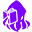

<h1>The Thing That Chose Your TBR </h1>  

  

#### Introduction
Ever had problems choosing from your TBR? Ever look up at the stars beyond, wondering if it could be easier? Well, _guess what?_ __The stars have answered!__ With the help of a certain cosmic horror, we can fix you up with your next book to read!  
  
___"Any consequences for invoking a cosmic horror?"___ _you say?_  ___Absolutely None <strike><small>that we know of!</small></strike>___   

<b>DISCLAIMER</b> The developer is not responsible for any supernatural-related incidents that may occur after using this software. If any such incident has occured, please contact your local Wizard for help.

#### About the program
A simple app that selects a random book from your exported Goodreads Library (.csv) and presents it neatly because-&nbsp;&nbsp;&nbsp;a&nbsp; e&nbsp; s&nbsp; t&nbsp; h&nbsp; e&nbsp; t&nbsp; i&nbsp; c&nbsp; s&nbsp; .  
Useful for those times when you can't seem to choose a book from your ever-growing TBR! (We've all been there!)  

The application is built using Tauri + pure Javascript/JQuery. It uses the Google Books API to retrieve the description and cover image of the chosen book.  

If you're wondering, your library (.csv) will not be uploaded anywhere. The application merely reads the file to build a list of possible books to choose from. It does not modify or send it someplace else. Feel free to review the code as you like.  

___

Acknowledgements: Parallax Stars by Sarensh Sinha • Galaxy Background by Suzy Hazelwood • Tilt.js by Gijs Rogé
